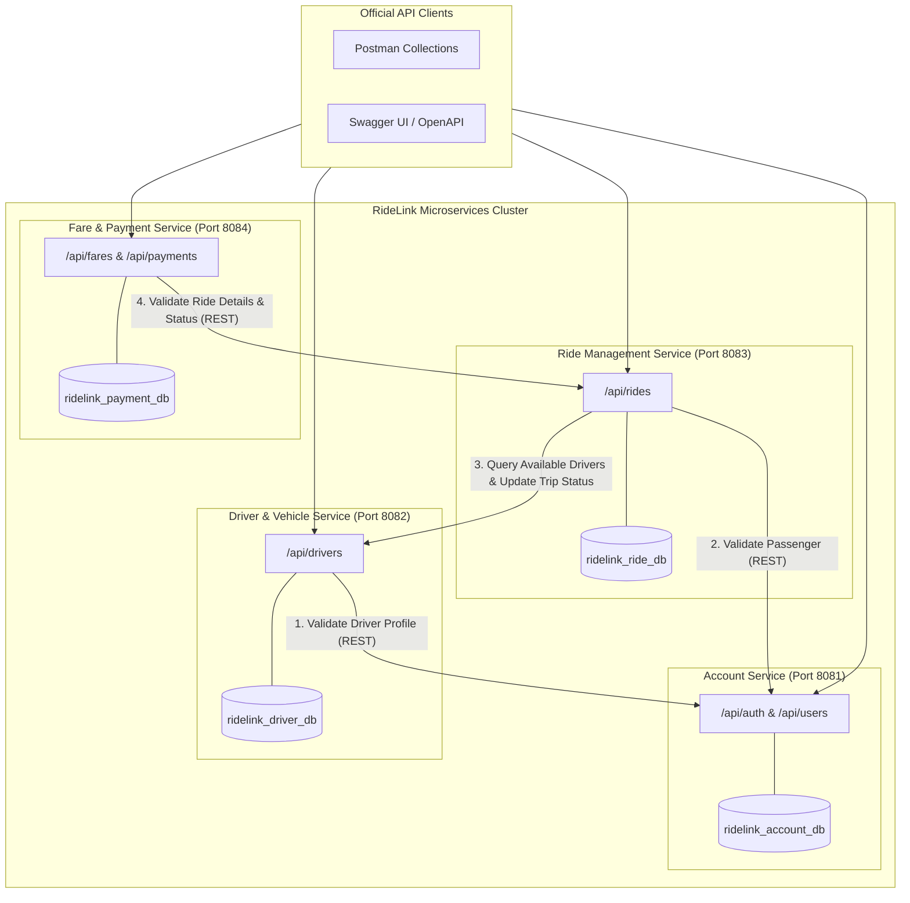
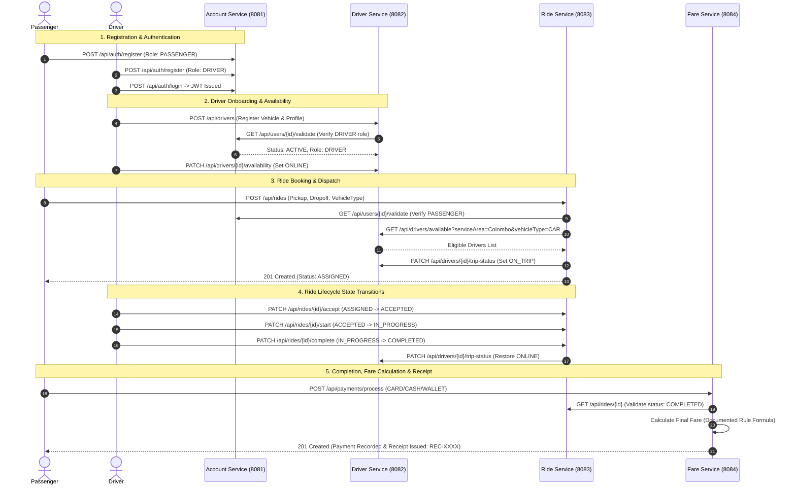

# RideLink - Backend Microservices for a Ride-Sharing Platform

[](https://github.com/Pasindu-Vihanga/ridelink-backend/actions/workflows/ci.yml)
[](https://openjdk.org/projects/jdk/21/)
[](https://spring.io/projects/spring-boot)
[](https://www.mongodb.com/)
[]()

> **Module**: IT3130 - Application Development  
> **Weight**: 30% Group Assignment  
> **Architecture**: Event-ready, Context-Appropriate Microservices with Independent Persistence Boundaries

---

## 1. Team Organisation & Service Ownership

| # | Microservice | Primary Owner | Branch | Port | Persistence Boundary (MongoDB) |
|---|---|---|---|---|---|
| **1** | **Account Service** | Member 1 | `account-service` | `8081` | `ridelink_account_db` |
| **2** | **Driver & Vehicle Service** | Member 2 | `driver-service` | `8082` | `ridelink_driver_db` |
| **3** | **Ride Management Service** | Member 3 | `ride-service` | `8083` | `ridelink_ride_db` |
| **4** | **Fare & Payment Service** | Member 4 | `fare-service` | `8084` | `ridelink_payment_db` |

---

## 2. System Architecture & Interservice Communication

Each service owns its own database according to the **Database-per-Service** pattern. Microservices communicate synchronously over HTTP REST interfaces using Spring `RestClient` with resilience timeouts.



---

## 3. End-to-End Business Lifecycle Sequence



---

## 4. Documented Fare Calculation Rule (Member 4)

Transparent pricing model implemented in `fare-service`:

$$\text{Fare} = \max\left(\text{MinimumFare},\; \text{round}\left(\left(\text{BaseFare} + (\text{DistanceKm} \times \text{PerKmRate}) + (\text{DurationMinutes} \times \text{PerMinuteRate})\right) \times \text{SurgeMultiplier},\; 2\right)\right)$$

| Vehicle Type | Base Fare (LKR) | Per Km Rate (LKR) | Per Minute Rate (LKR) | Minimum Fare Floor (LKR) |
|---|---|---|---|---|
| **CAR** | 200.00 | 120.00 | 10.00 | 250.00 |
| **VAN** | 350.00 | 160.00 | 15.00 | 400.00 |
| **TUK** | 100.00 | 80.00 | 8.00 | 150.00 |
| **BIKE** | 80.00 | 50.00 | 5.00 | 100.00 |

---

## 5. Prerequisites & Quick Start

### 5.1 Prerequisites
- **JDK 21** or higher
- **MongoDB 7.0+** running locally on default port `27017`
- **Git**

### 5.2 Build & Run All Microservices

To compile and verify all services at once from the root directory:
```bash
./mvnw clean test
```

### 5.3 Starting Services (Recommended Order)

Open 4 separate terminal windows or run each in the background:

```bash
# Terminal 1: Account Service (Member 1)
cd account-service
./mvnw spring-boot:run

# Terminal 2: Driver & Vehicle Service (Member 2)
cd driver-service
./mvnw spring-boot:run

# Terminal 3: Ride Management Service (Member 3)
cd ride-service
./mvnw spring-boot:run

# Terminal 4: Fare & Payment Service (Member 4)
cd fare-service
./mvnw spring-boot:run
```

---

## 6. OpenAPI / Swagger Documentation

Interactive API documentation and schema specifications are accessible via Swagger UI:

- **Account Service**: [http://localhost:8081/swagger-ui.html](http://localhost:8081/swagger-ui.html)
- **Driver Service**: [http://localhost:8082/swagger-ui.html](http://localhost:8082/swagger-ui.html)
- **Ride Service**: [http://localhost:8083/swagger-ui.html](http://localhost:8083/swagger-ui.html)
- **Payment Service**: [http://localhost:8084/swagger-ui.html](http://localhost:8084/swagger-ui.html)

---

## 7. Postman Collections & Testing Guide

Official Postman collections and environment file are located in the [`postman/`](file:///c:/Users/USER/Desktop/RideLink/postman/) directory:

1. **Environment File**:
   - [`RideLink_Local.postman_environment.json`](file:///c:/Users/USER/Desktop/RideLink/postman/RideLink_Local.postman_environment.json)
2. **Service Collections**:
   - `postman/RideLink_Account_Service.postman_collection.json`
   - `postman/RideLink_Driver_Service.postman_collection.json`
   - `postman/RideLink_Ride_Service.postman_collection.json`
   - `postman/RideLink_Payment_Service.postman_collection.json`

### Sample Test Credentials

| Role | Email | Password |
|---|---|---|
| **Passenger** | `passenger@example.com` | `Pass@1234` |
| **Driver** | `driver@example.com` | `Pass@1234` |
| **Admin** | `admin@example.com` | `Admin@1234` |

---

## 8. Automated Testing Evidence

Every service contains comprehensive unit tests and slice tests covering normal, boundary, and negative scenarios (95 total tests with 0 failures):

```
Results :

[INFO] Tests run: 30, Failures: 0, Errors: 0, Skipped: 0  (Account Service)
[INFO] Tests run: 21, Failures: 0, Errors: 0, Skipped: 0  (Driver & Vehicle Service)
[INFO] Tests run: 27, Failures: 0, Errors: 0, Skipped: 0  (Ride Management Service)
[INFO] Tests run: 17, Failures: 0, Errors: 0, Skipped: 0  (Fare & Payment Service)
[INFO] ------------------------------------------------------------------------
[INFO] Total Tests: 95 | BUILD SUCCESS
```

---

## 9. Continuous Integration (CI)

A GitHub Actions CI workflow is configured in [`.github/workflows/ci.yml`](file:///c:/Users/USER/Desktop/RideLink/.github/workflows/ci.yml). On every push or pull request to `main` or individual feature branches, it automatically spins up a MongoDB container, compiles all microservices, and runs the entire 95-test suite to prevent regressions.
